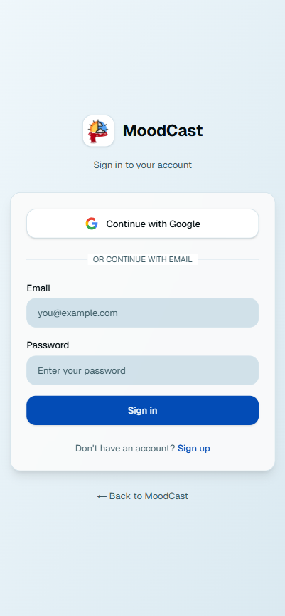
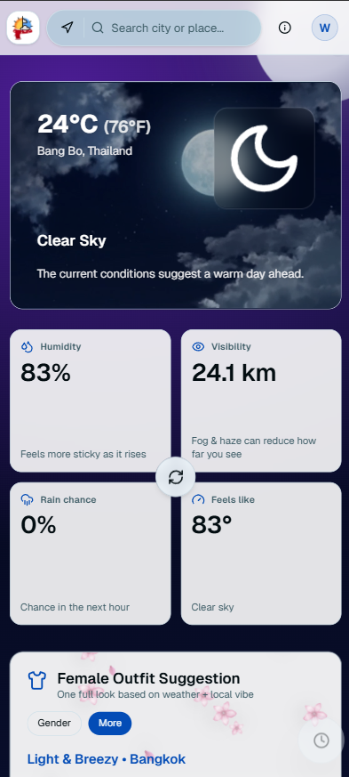
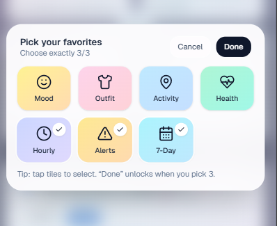
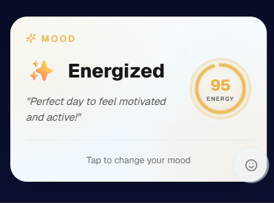
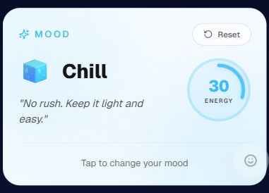
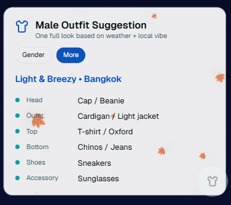
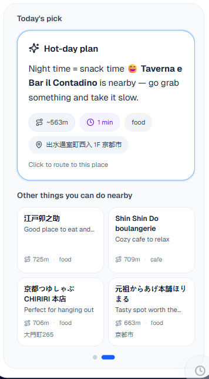
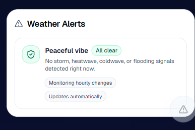

# MoodCast 🌤️🌙

MoodCast is a simple, aesthetic **weather + “what to do nearby”** app.
Search a city, instantly feel the **current vibe** (day/night + conditions), and get **quick activity ideas** around you — especially useful when you’re traveling or in a new area.

---

## Table of contents

- [Who it’s for](#who-its-for)
- [What’s cool about it](#whats-cool-about-it)
- [How to use](#how-to-use)
- [Features & screenshots](#features--screenshots)
- [Notes](#notes)
- [Getting started](#getting-started)
- [Environment variables](#environment-variables)
- [Roadmap](#roadmap)

---

## Who it’s for

- People who want a fast weather check that *feels* nice
- Anyone thinking: “What should I do today?” when they’re out (or traveling)
- Students / commuters who prefer a clean, no-noise forecast + quick ideas

---

## What’s cool about it

- **Vibe-based UI** that shifts for **day vs night**
- **Animated backgrounds** (day/night loops) for that “alive” feeling
- **Live activity suggestions** based on:
  - current weather
  - what’s nearby (parks, food, cafes, etc.)
- **Map + routing preview**
  - shows your position, destination, and route
  - route mode: **Walk / Bike / Drive**
- **Quick actions**
  - Start navigation
  - Open directions in **Google Maps** or **Apple Maps**
- **Clean cards**
  - distance + ETA + category tags
  - category tags are color-coded

---

## How to use

1. Search a city to view the weather vibe.
2. Tap **Suggested activity for today** to use GPS and get nearby ideas.
3. Pick a place from **Other things you can do nearby**.
4. Choose **Walk / Bike / Drive**, then hit **Start** or open in Google/Apple Maps.

---

## Features & screenshots

### 1) Authentication (Email / Google)
Login with email or Google (Supabase auth).

---

### 2) Auto location + live weather updates
- On first load, MoodCast uses your current location (if allowed) and shows current weather + related info.
- Searching a city updates the weather data to the selected location.

---

### 3) Assistant Dock (Quick Access)
Choose up to **3** quick actions/features.
Press **+** to open the full list and customize your shortcuts.

---

### 4) Mood system (weather-based + customizable)
Mood updates based on weather conditions, but you can adjust it for better accuracy.
This is important because mood influences **outfit suggestions**.

---

### 5) Outfit suggestions (WIP)
Outfit suggestions for both genders with a falling-leaves animation.
Outfits are generated based on weather info (**work in progress**).

---

### 6) Activity suggestions (Map + Places pages)
If you’re in a new place and don’t know what to do, use **Activity Suggestions**.
Includes two swappable pages: **Map view** and **Places list**.

---

### 7) 7-day forecast
Plan ahead for longer trips and vacations.

---

### 8) Weather alarm
Set a reminder/alarm to keep weather changes in mind.

---

### 9) Hourly forecast
See hour-by-hour forecast to decide if you should carry an umbrella.

---

## Notes

- If location permission is off, **map + live nearby suggestions** won’t show.
- Suggestions can change when you refresh (to keep it feeling fresh).

---
